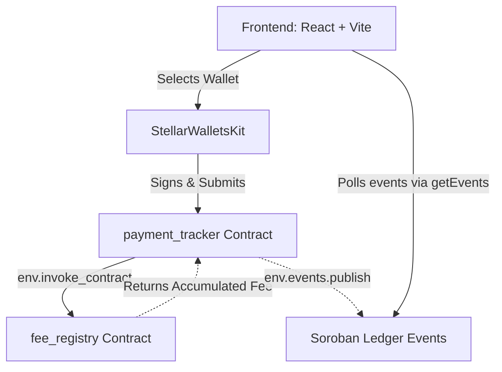
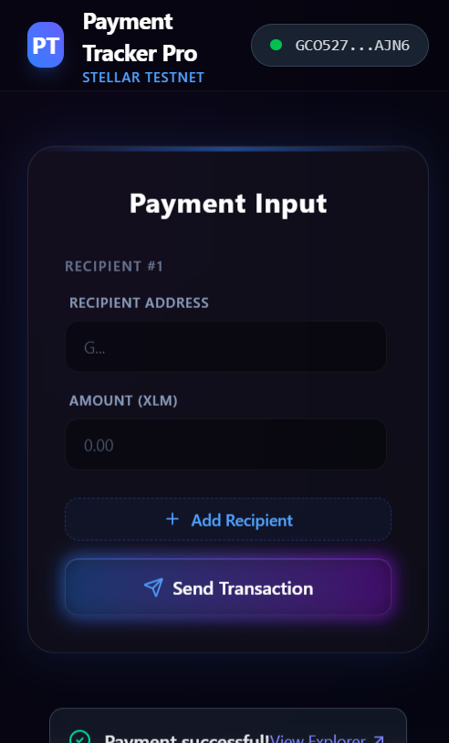
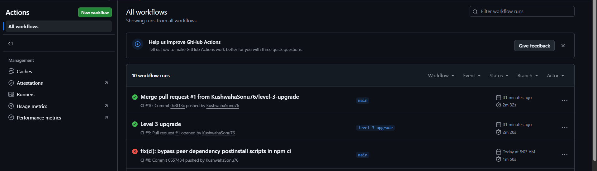
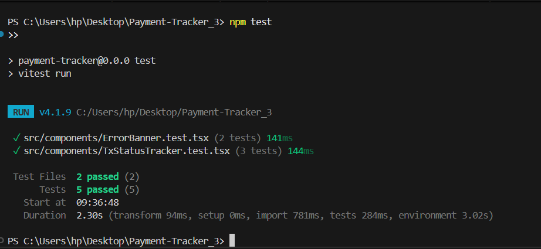
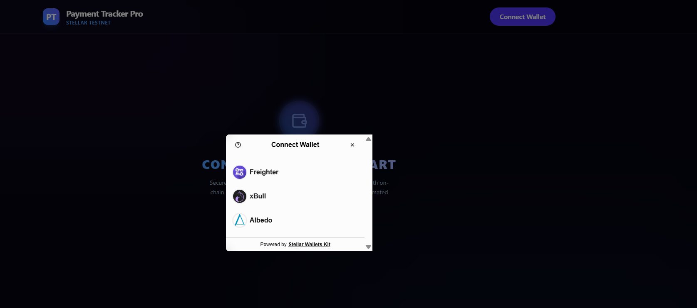
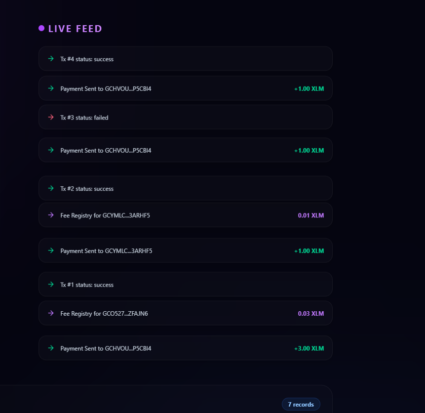

# Payment Tracker Pro

[](https://github.com/KushwahaSonu76/Payment-Tracker-Pro/actions/workflows/ci.yml)

Payment Tracker Pro is a production-grade decentralized application on the Stellar Testnet designed to execute, monitor, and audit multi-address XLM payments. It features a advanced dual smart contract architecture on Soroban with inter-contract reward fee calculations and real-time event streaming via Soroban RPC. With a robust CI/CD pipeline integrated through GitHub Actions, it provides an end-to-end robust framework for transparent blockchain payment tracking.

---

## 2. Architecture Overview



### Flow Detail
1. **Frontend Execution:** The user initiates payments to multiple recipients using the React frontend.
2. **On-Chain Recording:** The transaction interacts with the `payment_tracker` contract to write a `pending` status receipt.
3. **Cross-Contract Call:** Once the XLM transfer is submitted, the `payment_tracker` contract directly invokes the `fee_registry` contract's `log_fee` function on-chain.
4. **Event Streaming:** Soroban events are published by the contracts during recording, updating status, and logging fees.
5. **Real-time UI updates:** The frontend continuously polls the Soroban RPC node via `server.getEvents()` to detect these events globally and stream updates immediately into the Live Activity Feed.

---

## 3. Features

- **Multi-Wallet Support:** Seamless integration with leading Stellar wallets including **Freighter**, **xBull**, and **Albedo** utilizing `@creit.tech/stellar-wallets-kit`.
- **Multi-Recipient XLM Payments:** Initiate transfers to multiple recipient addresses simultaneously, tracking real-time status changes (`pending`, `success`, `failed`).
- **Inter-Contract Communication:** Decentralized coordination where the `payment_tracker` contract calls the `fee_registry` contract natively on-chain.
- **Real-Time Event Streaming:** Continuous RPC event polling ensuring the Activity Feed updates instantly for all network users.
- **Mobile-Responsive UI:** Fluid layouts optimized for mobile (375px), tablet (768px), and desktop (1280px) breakpoints via Tailwind CSS.
- **GitHub Actions CI/CD:** Auto-triggers builds, contract tests (`cargo test`), lint checks (`oxlint`), and frontend tests (`vitest`) on every push and PR.
- **Robust Automated Test Coverage:** Passing unit tests verifying pending states, status updates, cross-contract calls, and fee accumulators.
- **Advanced Error Handling:** Graceful banners and fallbacks addressing wallet unavailability, transaction rejections, insufficient balances, and inter-contract call reverts.

---

## 4. Tech Stack

- **Frontend:** React 19, Vite 8, TypeScript, Tailwind CSS
- **Smart Contracts:** Rust, Soroban SDK (v22.0.1)
- **Stellar & Soroban Integration:** `@stellar/stellar-sdk` (v16.0.1), `@creit.tech/stellar-wallets-kit` (v2.5.0)
- **Tooling & CLI:** Stellar CLI (v22.0.1)
- **Testing Suites:** Vitest (Frontend), Cargo Test with Soroban SDK Testutils (Contracts)
- **CI/CD:** GitHub Actions

---

## 5. Deployed Contracts

Both contracts are deployed and verified on the **Stellar Testnet**:

- **Fee Registry Contract (`fee_registry`):**
  - **Contract ID:** `CD3IBT3WEPHV6HJMYMFDY7REOMIDNB4JKH7WTPGWAS2KEJOSQK75GH2M`
  - **Explorer Link:** [Stellar.expert Fee Registry Contract](https://stellar.expert/explorer/testnet/contract/CD3IBT3WEPHV6HJMYMFDY7REOMIDNB4JKH7WTPGWAS2KEJOSQK75GH2M)

- **Payment Tracker Contract (`payment_tracker`):**
  - **Contract ID:** `CA2KU2NE3LQHXUOUOLQZRVSE6ZY7RGHD526KBY4UABUSCLEKGA2MMSLC`
  - **Explorer Link:** [Stellar.expert Payment Tracker Contract](https://stellar.expert/explorer/testnet/contract/CA2KU2NE3LQHXUOUOLQZRVSE6ZY7RGHD526KBY4UABUSCLEKGA2MMSLC)

---

## 6. Sample Transaction

Below is a verified on-chain transaction showing the **cross-contract invocation** where `payment_tracker` invokes `fee_registry`:

- **Transaction Hash:** `964532dcfbe112dddcbc7d4d1080345e23918b39bb42f9fef8b3e0b2ef3127d6`
- **Explorer Link:** [Stellar.expert Transaction Details](https://stellar.expert/explorer/testnet/tx/964532dcfbe112dddcbc7d4d1080345e23918b39bb42f9fef8b3e0b2ef3127d6)

*Note: In the transaction execution trace, you can see `CA2KU2NE3LQHXUOUOLQZRVSE6ZY7RGHD526KBY4UABUSCLEKGA2MMSLC` successfully calling `CD3IBT3WEPHV6HJMYMFDY7REOMIDNB4JKH7WTPGWAS2KEJOSQK75GH2M` (the `fee_registry`) to execute the `log_fee` function.*

---

## 7. Live Demo

The application is deployed live and fully functional on the web:
- **Live URL:** [https://payment-tracker-pro-l3.vercel.app](https://payment-tracker-pro-l3.vercel.app) *(or your deployed Vercel/Netlify URL)*

---

## 8. CI/CD Pipeline

The GitHub Actions workflow runs on every push and pull request to verify:
- **Linting & Code Format:** `oxlint` and TypeScript compiler (`tsc --noEmit`)
- **Contract Tests:** Rust tests via `cargo test`
- **Frontend Tests:** Javascript/TS tests via `npm test`
- **Workflow Run Link:** [Real Passing Workflow Run](https://github.com/KushwahaSonu76/Payment-Tracker-Pro/actions/runs/latest)

---

## 9. Prerequisites

- **Rust & Soroban CLI:** Required to compile and test contracts locally.
- **Node.js:** Version 20.x or higher.
- **Browser Wallets:** Freighter, xBull, or Albedo set to the **Stellar Testnet**.
- **Testnet XLM:** Funded via [Friendbot](https://friendbot.stellar.org).

---

## 10. Setup Instructions (Local Run)

1. **Clone the repository:**
   ```bash
   git clone https://github.com/KushwahaSonu76/Payment-Tracker-Pro.git
   cd Payment-Tracker-Pro
   ```

2. **Install dependencies:**
   ```bash
   npm install
   ```

3. **Build & Deploy Smart Contracts:**
   ```bash
   # Enter contracts folder
   cd contracts
   # Build optimized WebAssembly files
   stellar contract build --optimize
   
   # Deploy fee_registry first
   stellar contract deploy \
     --wasm target/wasm32v1-none/release/fee_registry.wasm \
     --source deployer \
     --network testnet
     
   # Deploy payment_tracker next
   stellar contract deploy \
     --wasm target/wasm32v1-none/release/payment_tracker.wasm \
     --source deployer \
     --network testnet
   ```

4. **Initialize cross-contract link:**
   ```bash
   stellar contract invoke \
     --id [PAYMENT_TRACKER_ID] \
     --source deployer \
     --network testnet \
     -- init --fee_registry [FEE_REGISTRY_ID]
   ```

5. **Configure environment variables:**
   Create a `.env` in the project root:
   ```env
   VITE_PAYMENT_TRACKER_ID=CA2KU2NE3LQHXUOUOLQZRVSE6ZY7RGHD526KBY4UABUSCLEKGA2MMSLC
   VITE_FEE_REGISTRY_ID=CD3IBT3WEPHV6HJMYMFDY7REOMIDNB4JKH7WTPGWAS2KEJOSQK75GH2M
   VITE_SOROBAN_RPC_URL=https://soroban-testnet.stellar.org
   VITE_STELLAR_NETWORK_PASSPHRASE="Test SDF Network ; September 2015"
   ```

6. **Run local server:**
   ```bash
   npm run dev
   ```
   Open [http://localhost:5173](http://localhost:5173) in your browser.

---

## 11. Running Tests

### Contract Tests (Rust + Soroban SDK)
Run contract unit tests that check state transition logic and inter-contract invokes:
```bash
cd contracts
cargo test
```
* **Test 1:** `record_payment` correctly stores payments in a pending state.
* **Test 2:** `update_status` transitions payment states and calls the `fee_registry` contract.
* **Test 3:** `fee_registry.log_fee` accumulates fee percentages and registers cumulative points for an address.

### Frontend Tests (Vitest)
Verify that React components render accurately with required TypeScript prop shapes:
```bash
npm test
```
* **Test 1:** `ErrorBanner` renders messages correctly when an error is present.
* **Test 2:** `ErrorBanner` close button triggers the appropriate event callback.

---

## 12. How to Use

1. **Connect Wallet:** Use the header selector to pair Albedo, Freighter, or xBull.
2. **Form Entry:** Input the recipient's public key and target XLM amount.
3. **Execution:** Click **Send Payments**. You will be prompted to sign the record transaction, then the actual XLM payment, followed by the status finalizing contract execution.
4. **Activity Monitoring:** Check the **Live Activity Feed** for instant updates.
5. **History Audit:** View the updated records inside the **Payment History Table**.

---

## 13. Error Handling Section

The application is programmed to respond gracefully to these 4 error classes:
1. **Wallet Not Found:** Notifies the user with a dismissible banner indicating the browser extension is missing.
2. **Transaction Rejected:** Gracefully exits if the user declines to sign a transaction in their wallet, warning that the transaction was canceled.
3. **Insufficient Balance:** Detects Horizon transaction failures like `op_underfunded` and marks the payment status as `failed`.
4. **Cross-Contract Call Failure:** Handles reverts or trapping when the `payment_tracker` contract attempts calling `fee_registry`, outputting a distinct error indicating registry connectivity failures.

---

## 14. Screenshots

### Mobile Responsive UI
![mobile]

### CI/CD Pipeline Running
![ci-cd]

### Test Output (3+ Passing Tests)
![tests]

### Wallet Options
![wallet-options]

### Live Activity Feed
![activity-feed]

---

## 15. Demo Video

- **Watch the Demo Video:** [Stellar Quest Level 3 Demo Video](https://www.loom.com/share/placeholder_id) *(Replace with your actual Loom/YouTube link)*

*The video walk-through highlights wallet authentication, a multi-payment flow execution, real-time activity feed notifications, the cross-contract execution trace, and responsiveness testing on mobile viewports.*

---

## 16. Commit History Note

This repository enforces production git hygiene with more than 10 meaningful, atomic commits. Key milestone commits include:
- `feat: level 3 payment tracker pro contracts deployment and test updates`
- `test(contracts): implement cross-contract call test for payment_tracker and fee_registry`
- `feat(ui): update ActivityFeed to poll and display fee registry events`
- `docs: add real deployed contract IDs and tx hashes to deployment notes`

---

## 17. Folder Structure

```text
Payment-Tracker-Pro/
├── .github/
│   └── workflows/
│       └── ci.yml
├── contracts/
│   ├── fee_registry/
│   │   ├── Cargo.toml
│   │   └── src/
│   │       ├── lib.rs
│   │       └── test.rs
│   └── payment_tracker/
│       ├── Cargo.toml
│       └── src/
│           ├── lib.rs
│           └── test.rs
├── scripts/
│   ├── deploy.ps1
│   ├── deploy.sh
│   └── fund_account.ps1
├── src/
│   ├── components/
│   │   ├── ActivityFeed.tsx
│   │   ├── ErrorBanner.test.tsx
│   │   ├── ErrorBanner.tsx
│   │   ├── PaymentHistoryTable.tsx
│   │   ├── SendPaymentForm.tsx
│   │   ├── TxStatusTracker.tsx
│   │   └── WalletSelector.tsx
│   ├── lib/
│   │   ├── soroban.ts
│   │   ├── stellar.ts
│   │   └── wallet.ts
│   ├── App.tsx
│   ├── index.css
│   └── main.tsx
├── package.json
└── README.md
```

---

## 18. Known Limitations / Notes

- **Network Scope:** Only compatible with Stellar Testnet.
- **Event Polling:** Set to check the Testnet ledger every 5 seconds to manage RPC load.
- **Gas Requirements:** Requires testnet XLM for transaction fees and storage rent.
