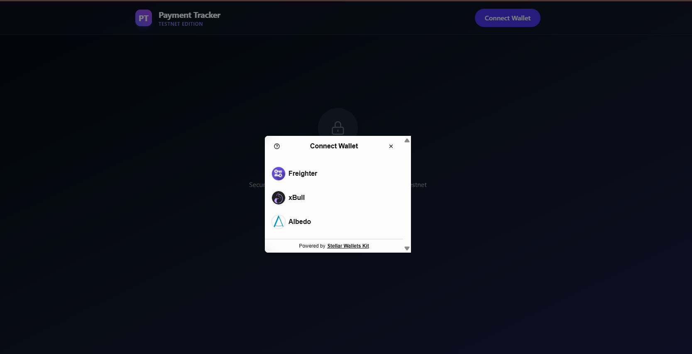
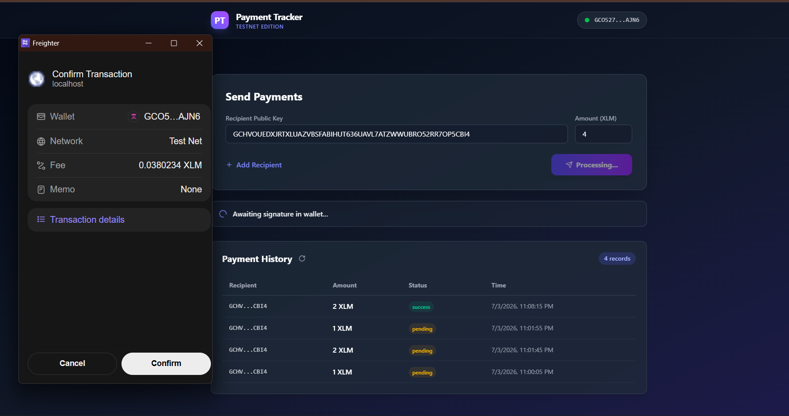
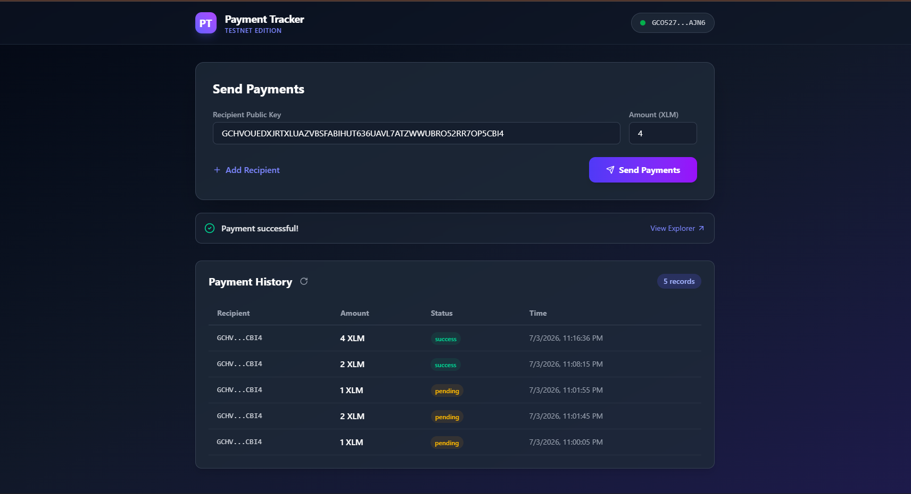
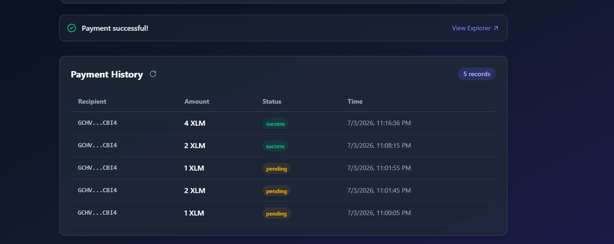

# Payment Tracker Pro

[](https://github.com/KushwahaSonu76/Payment-Tracker-Pro/actions/workflows/ci.yml)

A Stellar Testnet decentralized application for tracking payments on-chain with real-time event streaming and a reward fee system. Built for the Stellar Quest Level 3 - Orange Belt. (Updated)

## Level 3 Deliverables
- **Smart Contracts**: `payment_tracker` and `fee_registry` deployed to Testnet.
- **Inter-contract communication**: `payment_tracker` invokes `fee_registry` to log a fee on successful payment.
- **Event Streaming**: Activity feed implemented in `src/components/ActivityFeed.tsx` listening to Soroban events.
- **Responsive UI**: Fully mobile-responsive Tailwind CSS layout.
- **Testing & CI**: Configured GitHub Actions for Rust contract tests and Vitest frontend tests.

Payment Tracker allows users to connect their Stellar wallet, send XLM to multiple recipient addresses simultaneously, and securely record the payments along with their real-time statuses (`pending`, `success`, `failed`) directly on a Soroban smart contract.

## Features

- **Multi-Wallet Support via StellarWalletsKit:** Integration with **Freighter**, **xBull**, and **Albedo** wallets using `@creit.tech/stellar-wallets-kit` for seamless authentication and transaction signing on the Testnet.
- **Multi-Address XLM Payments:** Users can add multiple recipient addresses and specify amounts in a single interface to execute multiple transactions.
- **Smart Contract Deployed on Soroban Testnet:** The application calls a custom Rust smart contract to track and record payment metadata (sender, recipient, amount, status, timestamp).
- **Real-Time Payment History:** Dynamic ledger queries display a live feed of all payments initiated by the connected wallet with corresponding status badges (`pending`, `success`, `failed`).
- **Transaction Status Tracking:** Tracks the complete cycle of transaction processing (recording → simulating → signing → submitting → sending XLM → confirming → success/error).
- **3 Handled Error Types:**
  1. **Wallet Not Found:** Notifies the user if the selected wallet extension is not installed or detected.
  2. **Transaction Rejected:** Gracefully catches instances when the user cancels or rejects the signing prompt in their wallet.
  3. **Insufficient Balance / Contract Error:** Detects Horizon failures (e.g., `op_underfunded` due to low XLM balance) or contract call panics, immediately updating the status to `failed` and warning the user.

## Tech Stack

- **Frontend:** React, Vite, TypeScript, Tailwind CSS
- **Smart Contract:** Rust + Soroban SDK
- **Stellar Libraries:** `@stellar/stellar-sdk`, `@creit.tech/stellar-wallets-kit`
- **Development Tooling:** Stellar CLI, Node.js

## Deployed Contract Info

- **Contract ID:** `CAG52EC6BOCVCMCEBJBRGOECSLOC6S5E56B7TBCTVTRUBGTFEV75R3BA`
- **Network:** Stellar Testnet
- **Deployment Command Used:**
  ```bash
  stellar contract deploy \
    --wasm target/wasm32-unknown-unknown/release/payment_tracker.wasm \
    --source-profile default \
    --network testnet
  ```
- **Stellar Expert Link:** [Stellar.expert Contract Explorer](https://stellar.expert/explorer/testnet/contract/CAG52EC6BOCVCMCEBJBRGOECSLOC6S5E56B7TBCTVTRUBGTFEV75R3BA)

## Sample Transaction

- **Contract Deploy Transaction Hash:** `0958cf3bc2da31b9d8b7aebc65c8d5d3d529eeff3e125fb7c88872ec2b15d34f`
- **Link:** [Stellar.expert Transaction Explorer](https://stellar.expert/explorer/testnet/tx/0958cf3bc2da31b9d8b7aebc65c8d5d3d529eeff3e125fb7c88872ec2b15d34f)

## Prerequisites

- **Rust + Soroban CLI** (for building/deploying smart contracts)
- **Node.js** (v18.0.0 or higher recommended)
- **Wallet Extension:** Freighter, xBull, or Albedo installed in your browser and set to **Testnet**
- **Testnet XLM:** Funded via [Friendbot](https://friendbot.stellar.org)

## Setup Instructions (Local Run)

1. **Clone the repository:**
   ```bash
   git clone https://github.com/KushwahaSonu76/Live-Poll-2.git
   cd Live-Poll-2
   ```

2. **Install dependencies:**
   ```bash
   npm install --legacy-peer-deps
   ```

3. **(Optional) Build & Deploy Contract:**
   If you want to deploy your own contract:
   ```bash
   cd contracts/payment_tracker
   cargo build --target wasm32-unknown-unknown --release
   stellar contract deploy --wasm target/wasm32-unknown-unknown/release/payment_tracker.wasm --source-profile default --network testnet
   ```

4. **Configure Contract ID:**
   Open `src/lib/soroban.ts` and set your contract ID:
   ```typescript
   export const contractId = "YOUR_DEPLOYED_CONTRACT_ID";
   ```

5. **Run the local development server:**
   ```bash
   npm run dev
   ```

6. **Open the application:**
   Navigate to `http://localhost:5173` in your browser.

## How to Use

1. Click on the **Connect Wallet** button in the top navigation bar.
2. Select your preferred wallet (Freighter, xBull, or Albedo) from the modal.
3. In the **Send Payments** form, enter the recipient's public key and the XLM amount.
4. Click **+ Add Recipient** if you want to pay multiple addresses at once.
5. Click **Send Payments**.
6. The app will initiate Step 1 and ask you to approve the `record_payment` contract call to write a `"pending"` receipt.
7. Once confirmed, Step 2 will open a second wallet popup to sign the actual XLM payment operation.
8. Step 3 will run immediately after to call `update_status` and finalize the record as `"success"` or `"failed"`.
9. The **Payment History** table below will instantly refresh to display the updated transaction record.

## Error Handling Section

- **Wallet Not Found:** If a wallet is selected but its extension is not installed, the app displays a clear notification banner advising the user to install the wallet.
- **Transaction Rejected:** If the user declines to sign a transaction in their wallet, the app catches the rejection error and displays a `"Transaction was rejected in the wallet."` message without crashing the flow.
- **Insufficient Balance / Contract Error:** In case the sender has insufficient XLM to complete the transfer or pay gas fees, the application updates the record status to `"failed"` on-chain, stops the process, and renders an `"Insufficient balance / contract execution error"` banner.

## Screenshots

### Wallet Options Available


### Payment Form & Transaction Status



### Real-Time Payment History


## Commit History Note

This repository contains a detailed commit history of **40+ meaningful commits** representing development milestones such as UI component scoping, Soroban integrations, build-time configurations, contract error handling, and ledger version compatibility fixes.

## Folder Structure

```text
Live-Poll-2/
├── contracts/
│   └── payment_tracker/
│       ├── Cargo.toml
│       └── src/
│           └── lib.rs
├── public/
│   ├── favicon.svg
│   └── icons.svg
├── src/
│   ├── components/
│   │   ├── ErrorBanner.tsx
│   │   ├── PaymentHistoryTable.tsx
│   │   ├── SendPaymentForm.tsx
│   │   ├── TxStatusTracker.tsx
│   │   └── WalletSelector.tsx
│   ├── lib/
│   │   ├── soroban.ts
│   │   ├── stellar.ts
│   │   └── wallet.ts
│   ├── App.tsx
│   ├── index.css
│   └── main.tsx
├── package.json
└── README.md
```

## Known Limitations / Notes

- **Network Scope:** The dApp is configured exclusively for the Stellar Testnet.
- **Transaction Fees:** Submitting state to the blockchain requires gas fees in XLM; please ensure your connected wallet has testnet funds.
- **Polling Time:** On-chain transaction status polling is set to check the RPC node every 2 seconds.
